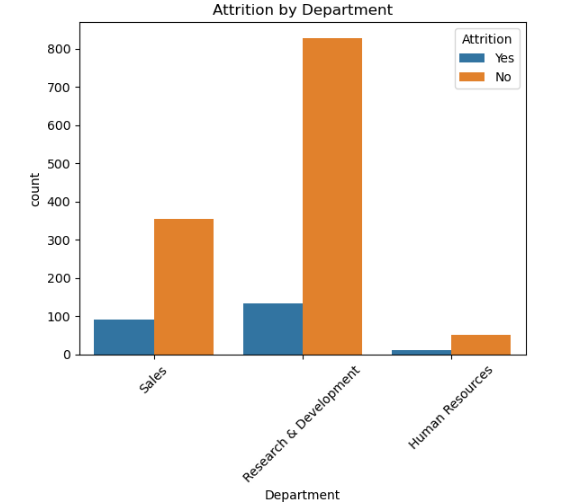
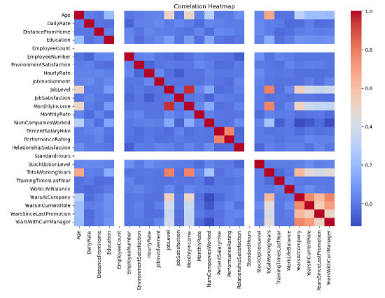

# HR Employee Attrition Analysis

## Project Overview
This project analyzes employee data to understand the key factors that contribute to employee attrition. The goal of the analysis is to identify patterns and insights that can help organizations reduce employee turnover and improve retention strategies.

## Dataset
The dataset contains HR employee information including:

- Age
- Department
- Business Travel
- Education
- Job Role
- Monthly Income
- Years at Company
- Job Satisfaction
- Work Life Balance
- Attrition (whether the employee left the company)

The dataset includes information for **1470 employees**.

## Tools Used
- Python
- Pandas
- Matplotlib
- Seaborn
- Jupyter Notebook

## Exploratory Data Analysis (EDA)
Several exploratory data analysis techniques were applied to better understand the dataset:

- Data inspection and cleaning
- Descriptive statistics
- Correlation analysis
- Employee attrition distribution analysis

## Visualizations
The project includes multiple visualizations such as:

- Employee Attrition Distribution
- Attrition by Department
- Attrition vs Age
- Attrition vs Overtime
- Monthly Income vs Attrition
- Correlation Heatmap
- Attrition by Age Group
- Department Attrition Rate

These visualizations help identify patterns and relationships between employee characteristics and attrition.

## Key Insights
Some important insights discovered from the analysis include:

- Approximately **16% of employees left the company**.
- Employees working **overtime** are more likely to leave the company.
- Certain **departments show higher attrition rates** than others.
- Lower **monthly income** appears to be associated with higher attrition.
- Younger employees tend to leave the company more frequently.

## Project Structure
hr-employee-attrition-analysis
│
├── hr_attrition_analysis.ipynb
├── hr_dataset.csv
└── README.md

## Purpose of the Project
This project was created as part of a **Data Analyst portfolio** to demonstrate skills in data exploration, visualization, and insight generation using Python.

## Visualizations

### Employee Attrition Distribution

### Correlation Heatmap

